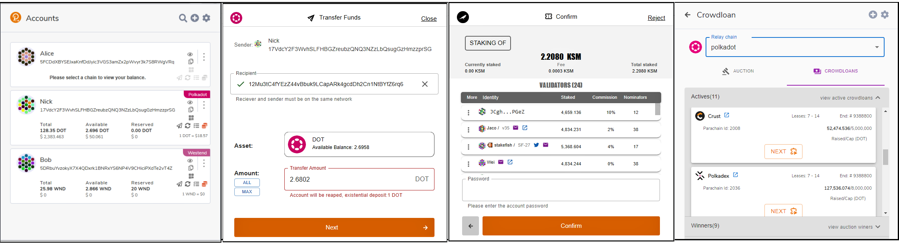

# 

A user-friendly wallet to interact with the Polkadot/Substrate based blockchains through a browser. It allows users to access their Polkadot account(s), which can also be used to interact with decentralized apps.

It is based on polkadot js extension, which injects a [@polkadot/api](https://github.com/polkadot-js/api) signer into a page, along with any associated accounts.

Polkadot js plus extension is actually the original polkadot js extension, plus some new functionalities.

## New functinalities

Currently, the following features are added:
  - View balances
  - Transfer funds
  - View an address as QR code
  - Staking / unstaking / redeem funds and edit nominated validator list
  - Contribute in crowdloans

# 

### More photos [wiki](https://github.com/Nick-1979/polkadot-Js-Plus-extension/wiki/How-To's)

## Installation 

### Add-on

The beta version of Plus extension for firefox can be downloaded from [here](https://addons.mozilla.org/en-US/firefox/addon/polkadot-js-plus-extension/)

### Development version

Steps to build the extension and view your changes in a browser:

1. Build via `yarn build` or `yarn watch`
2. Install the extension
  - Chrome:
    - go to `chrome://extensions/`
    - ensure you have the Development flag set
    - "Load unpacked" and point to `packages/extension/build`
    - if developing, after making changes - refresh the extension
  - Firefox:
    - go to `about:debugging#addons`
    - check "Enable add-on debugging"
    - click on "Load Temporary Add-on" and point to `packages/extension/build/manifest.json`
    - if developing, after making changes - reload the extension

Once added, you can create an account (via a generated seed) or import via an existing seed.

#### To test on westend:

1- check wheather westend genesis exists in './node_modules/@polkadot/networks/genesis.js', if not add the following:

    westend:['0xe143f23803ac50e8f6f8e62695d1ce9e4e1d68aa36c1cd2cfd15340213f3423e'] 

2- check wheather westend network info exists in './node_modules/@substrate/ss58-registry/index.js', if not add the following:

{
		"prefix": 42,
		"network": "westend",
		"displayName": "Westend",
		"symbols": [
			"WND"
		],
		"decimals": [
			12
		],
		"standardAccount": "*25519",
		"website": "https://polkadot.network"
	}

## More information 

for more information about the extension and how it worsk, please go to the project [wiki](https://github.com/Nick-1979/polkadot-Js-Plus-extension/wiki) 

## To support 

  17VdcY2F3WvhSLFHBGZreubzQNQ3NZzLbQsugGzHmzzprSG

  Cgp9bcq1dGP1Z9B6F2ccTSTHNez9jq2iUX993ZbDVByPSU2
